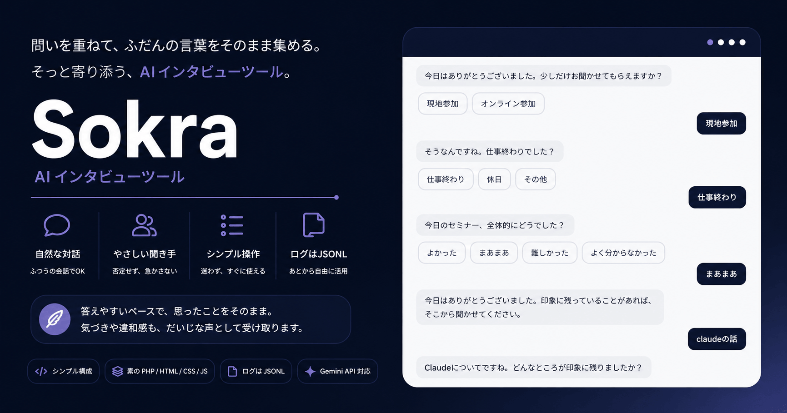

# Sokra

<p align="center">
  
</p>

<p align="center">
  <a href="https://github.com/yama/sokra"></a>
  
  
  
  
  <a href="LICENSE"></a>
</p>

**Sokra** は、自然な対話を通じて、率直な感想や記憶を集める AI インタビューツールです。  
ソクラテスの産婆術に着想を得ています。回答者を深く分からせることではなく、会話記録を読んだ主催者が後から洞察を得やすくすることを目指します。

名称の由来と設計解釈は [docs/maieutics.md](docs/maieutics.md) にまとめています。

PHP が動作する一般的なレンタルサーバでそのまま動かせます。  
フロントエンドのビルドも不要で、設置と設定が軽い構成です。

## できること

- セミナーやイベント後の感想を、会話形式で自然に集める
- 数問の選択式質問でウォームアップしてから自由会話へ入る
- Gemini を使って、会話の流れに沿った応答と終了判定を行う
- 会話ログを JSONL と JSON ダウンロードで保存し、後から NotebookLM などで分析できる

## 想定ユースケース

- セミナーやイベント後の感想収集
- プロジェクトのふりかえり
- 1on1 の事前準備
- 記述式フォームだと回答が薄くなりやすい場面全般

## コンセプト

従来のフォームは、質問側の前提を混ぜやすく、「正しそうな答え」を書かせがちです。  
Sokra は代わりに、感じのよい聞き手として振る舞い、雑談や脱線も許容しながら率直な感想を引き出しやすくします。

その場で深い分析を返すより、後から主催者が読み返して解釈できる会話記録を残すことを優先します。

> 目的は、役立つフィードバックを生成することではなく、率直な感想を集めることです。

## 仕組み

1. 数問のボタン選択で参加背景や温度感を集める
2. 直前の回答を受けて、自然な自由会話を続ける
3. 内部チェックポイントを持ちながらも、会話の流れを優先する
4. 会話ログを保存し、主催者が後から読み返して分析できる形で残す

会話設計の詳細は [DESIGN.md](DESIGN.md) を参照してください。

## 技術構成

- フロントエンド: PHP / HTML / CSS / JavaScript（ビルド不要）
- バックエンド: PHP
- AI: Gemini API
- E2E: Playwright
- ログ保存: `data/sessions/*.jsonl`

## 導入しやすさ

- PHP が動く一般的なレンタルサーバで動作
- ビルド不要で、そのまま配置しやすい
- API も同じ構成内で動くため、別プロセスの常駐アプリを前提にしない
- セッションログはサーバー上のファイル保存で扱える

## セットアップ

```bash
git clone ssh://git@github.com/yama/sokra.git
cd sokra
npm install
cp .env.example .env
npm start
```

`.env` では少なくとも次を設定します。

```dotenv
APP_ENV=development
GEMINI_API_KEY=
```

ローカル開発では `npm start` が `php -S 127.0.0.1:3000 router.php` を起動します。  
ブラウザで `http://127.0.0.1:3000` を開いてください。

API とルーティング、公開時の実行メモは [docs/runtime.md](docs/runtime.md) を参照してください。
E2E テストの実行方法は [docs/testing.md](docs/testing.md) を参照してください。
名称の由来と設計解釈は [docs/maieutics.md](docs/maieutics.md) を参照してください。

## 今後の予定

- [ ] 主催者向け設定 UI
- [ ] 主催者向けの事前設定フロー
- [ ] 主催者向けの会話記録整理・確認 UI
- [ ] 主催者向けの洞察支援フロー
- [ ] 複数セッションのログ集約
- [ ] 配布タイミング制御
- [ ] セミナー以外への汎用化
